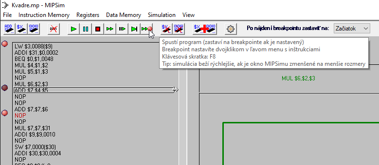
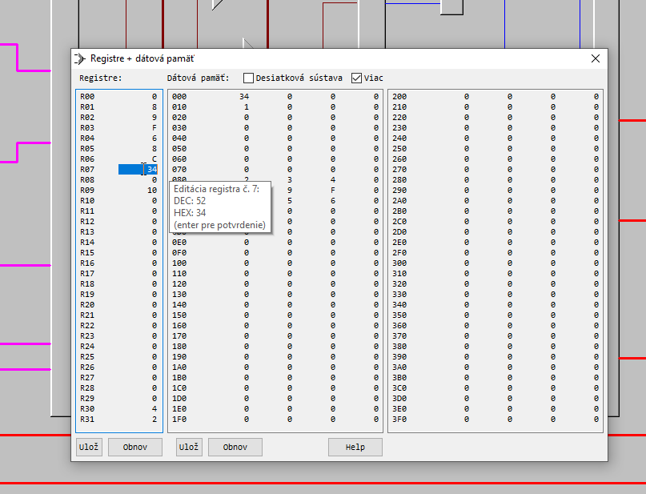
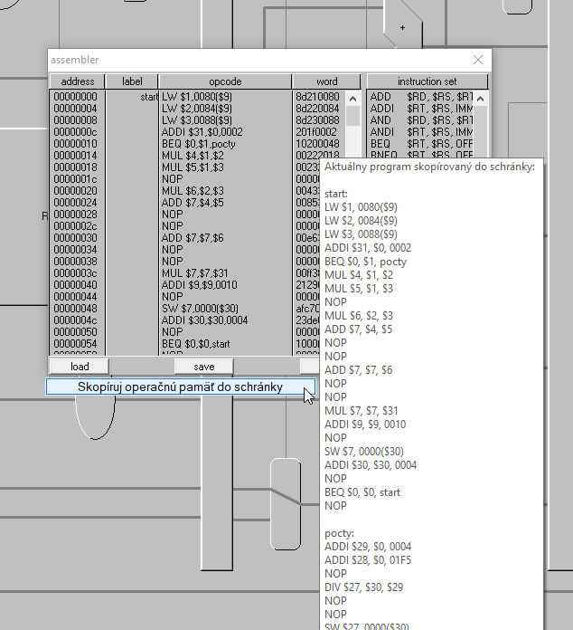
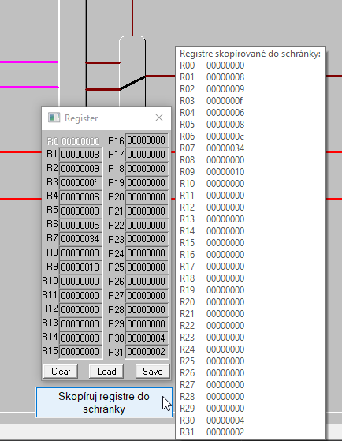
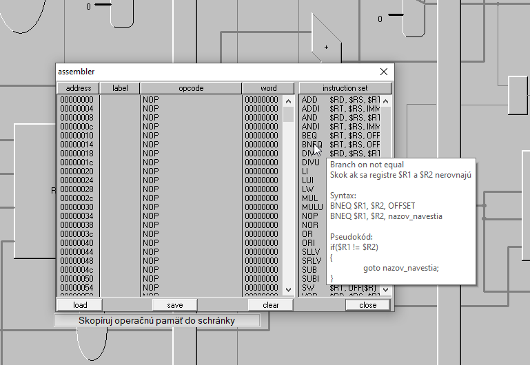
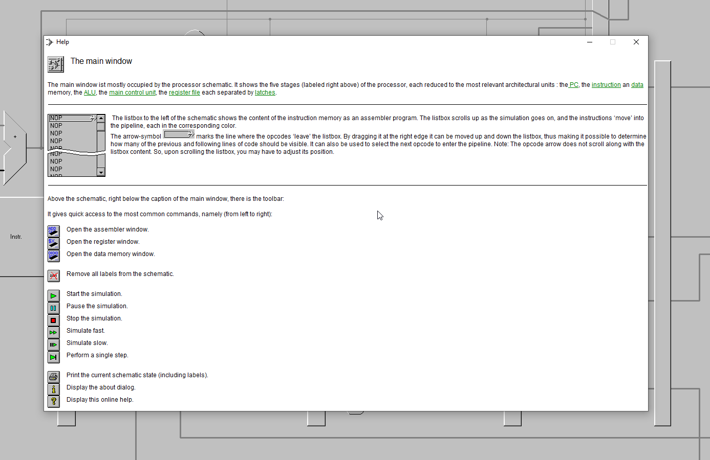
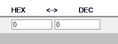
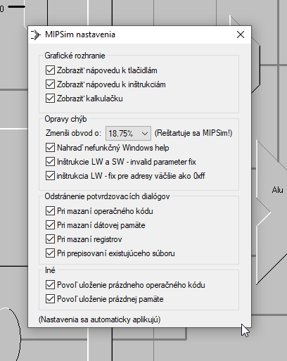

# MIPSim overlay

Pokus o oživenie MIPSIMu zaplátaním jeho hlavných chýb a vytvorením grafickej nadstavby s autoclickerom, breakpointami, editorom pamäti+registrov, exportom kódu do schránky, vstavanou nápovedou a inými "quality of life" vylepšeniami.

Pôvodný MIPSim 1.2 vytvoril Prof. Herbert Grünbacher na Vienna University of Technology pre Windows NT4 a Windows 95 platformy.

Celé je to jeden veľký hack. Ide o jeden z mojich prvých veľkých projektov z roku 2018 z čias, keď som sa ešte učil programovať a vykonávať reverzné inžinierstvo. Kód nie je moc pekný, ale aspoň v 50 % prípadoch funguje :D

## Rozšírenia MIPSIMu

Autoclicker s breakpointami (brekapoint vytvoríte dvojklikom na názov inštrukcie):

Vlastný editor registrov a operačnej pamäte so save/restore funkciou:

Export kódu a registrov do schránky:

Vysvetlivky k jednotlivým inštrukciám priamo v MIPSIMe:

Opravený help pre Windows 10 a vyššie:

Vstavaný prevodník medzi HEX a DEC (signed 32-bit) sústavou:

A plno ďalších fixov. Jednotlivé záplaty je možné zapnúť alebo vypnúť v nastaveniach:

## Kompatibilita MIPSIMu na Windowse

Nadstavba bola vyvíjaná a testovaná na Windows 10. Ak nadstavba nefunguje, použite pôvodný MIPSIM (zo zložky `original/`), ktorý má menej problémov s kompatibilitou.

### Windows 7

Na Windows 7 funguje overlay iba ak je mierka nastavená na 100 %. Pre upravenie mierky vo Windows 7:
- pravý klik na plochu -> screen resolution -> Make text and other items larger or smaller -> Smaller 100% (default) -> Apply

### Windows 10

Na Windows 10 je tiež odporúčané spúštať na monitore s mierkou 100 %, ale na tomto systéme by overlay už mal fungovať aj s inými mierkami (aj keď grafické rozhranie bude rozmazané oproti iným mierkam).

INFO: V niektorých starších verziách Windows 10 buildoch (vydaných cca 2020-2022) bola rozbitá kompatibilita s týmito staršími aplikáciami (tooltipy a čítanie z pamäte procesu nefungovali správne), ale na aktuálnom Windowse 10.0.19045 je to už opravené (overené 2023-12-13).

## Kompatibilita MIPSIMu na Linuxe

Pôvodný MIPSIM (v zložke `original/`) je možné spustiť bez problémov cez wine na linuxe.

Taktiež je možné vytvoriť zaplátanú binárku - aplikujte niektoré záplaty zo zložky `src/zaplaty` na originálny `MIPSIM.exe` cez [x32dbg](https://x64dbg.com/#start) a túto binárku spúšťajte cez wine. Bližšie inštrukcie ako zaplátať binárku sú nižšie

Na linuxe nie je možné spustiť overlay, pretože AutoHotKey (súbory končiace na `.ahk`) je dostupný iba pre Windows.

## Spustenie MIPSIM overlay zo zdrojového (ahk) súboru

- Nainštalujte AutoHotKey v1 ako 32-bitovú Unicode verziu
- prejdite do priečinka `src/` a spustite súbor `MIPSim overlay.ahk`

## "Kompilácia" nadstavby do exe súboru

Kompilácia nie je potrebná (stačí spúšťať súbor `MIPSim overlay.ahk` cez AutoHotKey.) - vhodné ak chcete distribuovať overlay ako `.exe` súbor bez potreby inštalácie AutoHotKey. 

- Predpoklad je nainštalované AutoHotKey v1 ako 32-bitová Unicode verzia.
- prejdite do priečinka `src/`, kde sa nachádza súbor `MIPSim overlay.ahk`
- vyvolajte pravý klik na súbor `MIPSim overlay.ahk` a zvoľte `Compile Script`
- vytvorí sa súbor `MIPSim overlay.exe`, ktorý je možné distribuovať. Tento `.exe` súbor v sebe obsahuje všetky závislosti
- overenie - presuňte `MIPSim overlay.exe` do iného priečinka a spustite ho. Niektoré autohotkey verzie nesprávne zabalia do `.exe` súboru závislosti, ktoré po rozbalení mají veľkosť 0 bajtov - ak sa vám to stane, tak použite novšiu verziu autohotkey

## Aplikácia záplat do MIPSIMu

záplaty sú aplikované pomocou debuggera [x32dbg](https://x64dbg.com/#start)

- spustite x32dbg debugger
- File -> Open -> MIPSIM32.EXE
- View -> Patch file
- import -> zaplataXYZ.1773
- patch file -> meno_nového_.exe_súboru

Pre informácie o jednotlivých záplatách prejdite na [src/zaplaty/README.md](src/zaplaty/README.md)

## Ako overlay funguje

- overlay spustí originálny MIPSIM program a vytvorí priehľadné okno, ktoré sa umiestni nad MIPSIM okno. Následne cez Windows api číta a zapisuje do pamäte procesu MIPSIMu - dynamicky aplikuje záplaty z priečinka `src/zaplaty/` podľa nastavení, automaticky kliká na tlačidlá, menu možnosti, ...

## Reset konfigurácie

Zmažte súbor `nastavenia.ini` a reštartujte overlay

## Iné upozornenia

- overlay používa systémové volania Windows api, ktoré čítajú a plátajú pamäť cudzieho procesu - počas jeho behu nepoužívajte iné programy (najmä hry s anticheatom), ktoré takéto volania detegujú a môžu ich nesprávne vyhodnotiť ako nežiadúce

## Známe chyby

- ak editujete v editore kódu inštrukciu (okno `assembler`) a zároveň scrollujete, tak si prepíšete inštrukcie na iných riadkoch - odporúčam kliknúť vedľa na `label` stĺpec a potom scrollovať
- na niektorých systémoch pointer chain na simulovanú pamäť alebo registre MIPSIMu nesmeruje na správne miesto a vykresľuje nerelevanú časť pamäte - pointer scany sú v zložke `src/pointer-scans/`, pull requesty sú vítané :)

## Licencie

pôvodný MIPSim 1.2 - executables must be available for free to the public domain

Nadstavba + záplaty - GPL v3

## Príspevky

Ak ste si ešte nepovedali, že radšej to prepíšete odznova, tak pull requesty a hviezdičky sú vítané :)